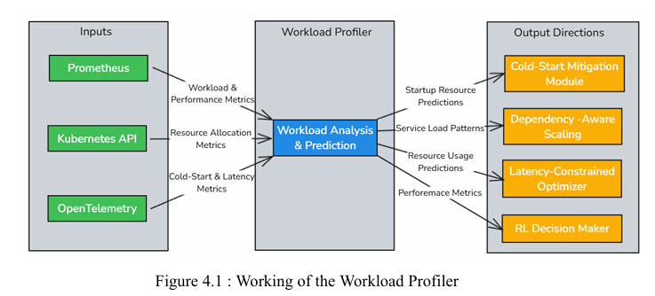
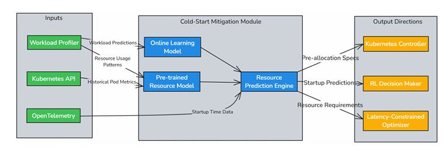

[comment]: # "This is the standard layout for the project, but you can clean this and use your own template"

# AI Dirven Latency Constrained Resource Management In Kubernetes

#### Team

- E/19/003, Abeysinghe A.M.H.P., [e19003@eng.pdn.ac.lk](mailto:name@email.com)
- E/19/155, Jayarathna B.R.U.K., [e19155@eng.pdn.ac.lk](mailto:name@email.com)
- E/19/166, Jayathunga W.W.K., [e19166@eng.pdn.ac.lk](mailto:name@email.com)

#### Supervisors

- Prof. Roshan Ragel, [roshanr@eng.pdn.ac.lk](mailto:name@eng.pdn.ac.lk)
- Dr. Isuru Nawinne, [isurunawinne@eng.pdn.ac.lk](mailto:name@eng.pdn.ac.lk)
- Dr. Malith Jayasinghe, [malithj@wso2.com](mailto:name@eng.pdn.ac.lk)

#### Table of content

1. [Abstract](#abstract)
2. [Related works](#related-works)
3. [Methodology](#methodology)
4. [Experiment Setup and Implementation](#experiment-setup-and-implementation)
5. [Results and Analysis](#results-and-analysis)
6. [Conclusion](#conclusion)
7. [Publications](#publications)
8. [Links](#links)

---

<!-- 
DELETE THIS SAMPLE before publishing to GitHub Pages !!!
This is a sample image, to show how to add images to your page. To learn more options, please refer [this](https://projects.ce.pdn.ac.lk/docs/faq/how-to-add-an-image/)
 
-->

## Abstract
Modern cloud-native applications often run on Kubernetes with conservative resource limits to avoid service degradation. However, this leads to substantial CPU and memory overprovisioning, increasing operational cost without proportional performance benefits. This research addresses the challenge of reducing Kubernetes resource limits and requests for microservices while keeping latency within acceptable Service-Level Objectives (SLOs), specifically allowing no more than a 20% increase from the baseline latency. Through controlled experiments on multiple Java and Go-based microservices, we analyze latency patterns under CPU-only, memory-only, and combined resource reductions. We discover service-specific resource sensitivity profiles, identify non-linear latency cliffs (Critical Reduction Points), and uncover the compounded behavior caused by simultaneous resource constraints. The insights lay the foundation for designing intelligent, SLA-aware resource tuners using machine learning, reinforcement learning, and Bayesian optimization. Our ultimate goal is to integrate this solution into platforms like Choreo to support dynamic, real-time resource tuning that is both cost-effective and performance-stable.

## Related works
* Kubernetes Autoscaling (HPA/VPA/KEDA): Existing autoscaling tools use reactive CPU or memory metrics but lack SLA-awareness or predictive modeling.

* Reinforcement Learning in Cloud Systems: RL has been applied for VM placement and dynamic autoscaling, but rarely for fine-grained limit tuning in Kubernetes.

* Bayesian Optimization in Systems Tuning: Used in configuration tuning (e.g., Google Vizier), but underexplored in real-time latency-aware resource policies.

* CRP Identification: Most prior works do not model Critical Reduction Points (CRPs) or non-linear latency responses.

This work contributes a hybrid of empirical workload characterization and intelligent control for latency-preserving resource tuning.

## Methodology

### Workload Profiler
The Workload Profiler resides inside each pod and continuously monitors real-time 
metrics. These metrics are gathered using Prometheus, Kubernetes API, 
OpenTelemetry and serve as the foundation for predicting future resource demands.  
 

### Cold-Start Mitigation Module
This module is also deployed within each pod to reduce the delays associated with 
starting new pods. By using pre-trained models and incremental online learning 
techniques, it predicts the resource requirements of a pod before it starts, enabling  proactive resource pre-allocation. This approach ensures that new pods can quickly 
become operational without causing service interruptions or performance degradation. 
Moreover, by predicting resource needs in advance, the system can reduce the time it 
takes to allocate the necessary resources, thus decreasing startup latency and 
improving the overall responsiveness of the system. 

## Experiment Setup and Implementation

## Results and Analysis

## Conclusion

## Publications
[//]: # "Note: Uncomment each once you uploaded the files to the repository"

<!-- 1. [Semester 7 report](./) -->
<!-- 2. [Semester 7 slides](./) -->
<!-- 3. [Semester 8 report](./) -->
<!-- 4. [Semester 8 slides](./) -->
<!-- 5. Author 1, Author 2 and Author 3 "Research paper title" (2021). [PDF](./). -->

## Links

[//]: # ( NOTE: EDIT THIS LINKS WITH YOUR REPO DETAILS )

- [Project Repository](https://github.com/cepdnaclk/e19-4yp-AI-Dirven-Latency-Constrained-Resource-Management-In-Kubernetes)
- [Project Page](https://cepdnaclk.github.io/e19-4yp-AI-Dirven-Latency-Constrained-Resource-Management-In-Kubernetes)
- [Department of Computer Engineering](http://www.ce.pdn.ac.lk/)
- [University of Peradeniya](https://eng.pdn.ac.lk/)

[//]: # "Please refer this to learn more about Markdown syntax"
[//]: # "https://github.com/adam-p/markdown-here/wiki/Markdown-Cheatsheet"
