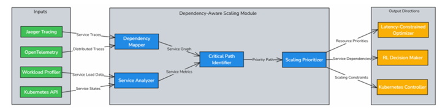
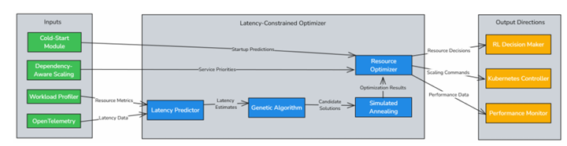
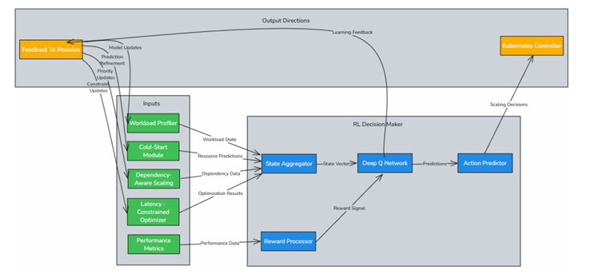

[comment]: # "This is the standard layout for the project, but you can clean this and use your own template"

# AI Dirven Latency Constrained Resource Management In Kubernetes

#### Team

- E/19/003, Abeysinghe A.M.H.P., [e19003@eng.pdn.ac.lk](mailto:name@email.com)
- E/19/155, Jayarathna B.R.U.K., [e19155@eng.pdn.ac.lk](mailto:name@email.com)
- E/19/166, Jayathunga W.W.K., [e19166@eng.pdn.ac.lk](mailto:name@email.com)

#### Supervisors

- Prof. Roshan Ragel, [roshanr@eng.pdn.ac.lk](mailto:name@eng.pdn.ac.lk)
- Dr. Isuru Nawinne, [isurunawinne@eng.pdn.ac.lk](mailto:name@eng.pdn.ac.lk)
- Dr. Malith Jayasinghe, [malithj@wso2.com](mailto:name@eng.pdn.ac.lk)

#### Table of content

1. [Abstract](#abstract)
2. [Related works](#related-works)
3. [Methodology](#methodology)
4. [Experiment Setup and Implementation](#experiment-setup-and-implementation)
5. [Results and Analysis](#results-and-analysis)
6. [Conclusion](#conclusion)
7. [Publications](#publications)
8. [Links](#links)

---

<!-- 
DELETE THIS SAMPLE before publishing to GitHub Pages !!!
This is a sample image, to show how to add images to your page. To learn more options, please refer [this](https://projects.ce.pdn.ac.lk/docs/faq/how-to-add-an-image/)
 
-->

## Abstract
Modern cloud-native applications often run on Kubernetes with conservative resource limits to avoid service degradation. However, this leads to substantial CPU and memory overprovisioning, increasing operational cost without proportional performance benefits. This research addresses the challenge of reducing Kubernetes resource limits and requests for microservices while keeping latency within acceptable Service-Level Objectives (SLOs), specifically allowing no more than a 20% increase from the baseline latency. Through controlled experiments on multiple Java and Go-based microservices, we analyze latency patterns under CPU-only, memory-only, and combined resource reductions. We discover service-specific resource sensitivity profiles, identify non-linear latency cliffs (Critical Reduction Points), and uncover the compounded behavior caused by simultaneous resource constraints. The insights lay the foundation for designing intelligent, SLA-aware resource tuners using machine learning, reinforcement learning, and Bayesian optimization. Our ultimate goal is to integrate this solution into platforms like Choreo to support dynamic, real-time resource tuning that is both cost-effective and performance-stable.

## Related works
* Kubernetes Autoscaling (HPA/VPA/KEDA): Existing autoscaling tools use reactive CPU or memory metrics but lack SLA-awareness or predictive modeling.

* Reinforcement Learning in Cloud Systems: RL has been applied for VM placement and dynamic autoscaling, but rarely for fine-grained limit tuning in Kubernetes.

* Bayesian Optimization in Systems Tuning: Used in configuration tuning (e.g., Google Vizier), but underexplored in real-time latency-aware resource policies.

* CRP Identification: Most prior works do not model Critical Reduction Points (CRPs) or non-linear latency responses.

This work contributes a hybrid of empirical workload characterization and intelligent control for latency-preserving resource tuning.

## Methodology

### Workload Profiler
The Workload Profiler resides inside each pod and continuously monitors real-time 
metrics. These metrics are gathered using Prometheus, Kubernetes API, 
OpenTelemetry and serve as the foundation for predicting future resource demands.  
 

### Cold-Start Mitigation Module
This module is also deployed within each pod to reduce the delays associated with 
starting new pods. By using pre-trained models and incremental online learning 
techniques, it predicts the resource requirements of a pod before it starts, enabling  proactive resource pre-allocation. This approach ensures that new pods can quickly 
become operational without causing service interruptions or performance degradation. 
Moreover, by predicting resource needs in advance, the system can reduce the time it 
takes to allocate the necessary resources, thus decreasing startup latency and 
improving the overall responsiveness of the system. 

### Dependency-Aware Scaling Module
The Dependency-Aware Scaling Module is deployed at the node level as part of the 
Custom Controller. It leverages distributed tracing tools like Jaeger and 
OpenTelemetry to map inter-service dependencies and identify critical microservices. 
This module ensures that tightly coupled services are allocated prioritized resources,  preventing scaling actions from negatively affecting dependent services and 
maintaining system balance and efficiency. 

### Latency Constrained Optimizer
Also part of the Custom Controller, the Latency-Constrained Optimizer utilizes 
metaheuristic algorithms, such as Genetic Algorithms (GA) and Simulated Annealing 
(SA), to determine the optimal allocation of CPU and memory resources across the 
node. The optimizer ensures that scaling decisions do not increase latency by more 
than a given threshold. It incorporates a latency prediction model to estimate the impact of resource changes before applying them. By constantly evaluating resource 
adjustments and their potential impact on overall system latency, the optimizer strives 
to maintain system responsiveness while optimizing resource distribution to prevent 
bottlenecks 

### Reinforcement Learning-Based Decision Maker
This module operates at both the pod level and within the Custom Controller. At the 
pod level, a reinforcement learning model using Deep Q Networks learns the optimal 
scaling policy based on historical and real-time data. At the node level, the RL model 
aggregates feedback from individual pods and collaborates with the 
Latency-Constrained Optimizer to refine global scaling decisions. The reward 
function penalizes actions leading to excessive latency, ensuring both resource 
efficiency and latency awareness in all decisions. Additionally, the RL model 
continuously refines its decision-making process, adapting to evolving system 
conditions and optimizing scaling policies to meet long-term performance goals. 

## Experiment Setup and Implementation
### Services Tested:

1. Prime Verifier (Java)
2. Echo (Go)
3. Hash Generator (Java)
4. Password Generator (Java)

### Load Generation: 
Constant 10–20 requests/sec per service.

### Metrics Collected:

* CPU Usage, CPU Limit, Memory Usage, Memory Limit
* Latency (p95), timestamped at regular intervals

### Automation Tools:

* Custom Kubernetes cronjobs for reduction
* Prometheus for monitoring
* Python & Matplotlib for visualization
* Bash/ConfigMaps for limit patching

## Results and Analysis

### Latency Profiles

#### CPU-bound Services
- **Prime Verifier**
- **Hash Generator**

#### Memory-resilient Services
- **Echo**
- **Password Generator**

**Note:** Echo remained stable under all reductions.

### Critical Reduction Points (CRPs)

Small additional reductions beyond CRP caused exponential latency spikes.

### Combined Reductions

Nonlinear and sometimes adaptive behavior observed. For example, the JVM improved under tighter GC pressure.

### Comparative Analysis

| Service | CPU-Only | Memory-Only | Combined |
|---------|----------|-------------|----------|
| Prime Verifier | Gradual spike | Mild | Latency cliff |
| Echo (Go) | No change | No change | Very stable |
| Hash Generator | Immediate spikes | Flat → volatile | Chaotic |
| Password Generator | Step-wise spikes | Bursty | Unexpected dips |

## Conclusion

## Publications
[//]: # "Note: Uncomment each once you uploaded the files to the repository"

<!-- 1. [Semester 7 report](./) -->
<!-- 2. [Semester 7 slides](./) -->
<!-- 3. [Semester 8 report](./) -->
<!-- 4. [Semester 8 slides](./) -->
<!-- 5. Author 1, Author 2 and Author 3 "Research paper title" (2021). [PDF](./). -->

## Links

[//]: # ( NOTE: EDIT THIS LINKS WITH YOUR REPO DETAILS )

- [Project Repository](https://github.com/cepdnaclk/e19-4yp-AI-Dirven-Latency-Constrained-Resource-Management-In-Kubernetes)
- [Project Page](https://cepdnaclk.github.io/e19-4yp-AI-Dirven-Latency-Constrained-Resource-Management-In-Kubernetes)
- [Department of Computer Engineering](http://www.ce.pdn.ac.lk/)
- [University of Peradeniya](https://eng.pdn.ac.lk/)

[//]: # "Please refer this to learn more about Markdown syntax"
[//]: # "https://github.com/adam-p/markdown-here/wiki/Markdown-Cheatsheet"
